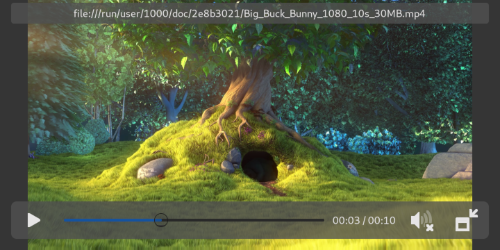

µPlayer
=======

Minimalistic video player using GTK4 and GStreamer. The main purpose is to make
playing hw accelerated videos with hantro and OpenGL simple.

It supports:

- Inhibiting suspend/idle when playing video
- Stopping video playback on (i.e. power button toggled) blank
- Registering as default video player in GNOME control center

Building
========

Flatpak build:

    # Intial setup
    flatpak install --user org.gnome.Sdk//master
    flatpak install --user org.gnome.Platform//master
    # Build
    flatpak-builder --force-clean  --install --user _build/ org.sigxcpu.Livi.json

Regular build:

    # Intial setup
    apt build-dep .
    # Build
    meson setup . _build
    meson compile -C _build
