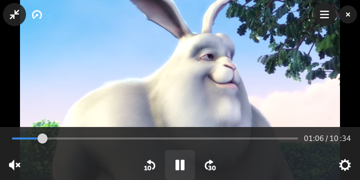

µ-Player
========

Minimalistic video player using GTK4 and GStreamer. The main purpose is to make
playing hw accelerated videos with hantro and OpenGL simple.

It supports:

- Inhibiting suspend/idle when playing video
- Stopping video playback on (i.e. power button toggled) screen lock
- Registering as default video player in GNOME control center

Building
========

Most distribution don't ship recent enough GTK4 and gstreamer atm so it's simplest
to build and install as a flatpak via

    flatpak-builder --force-clean  --install --user _build/ org.sigxcpu.Livi.json
